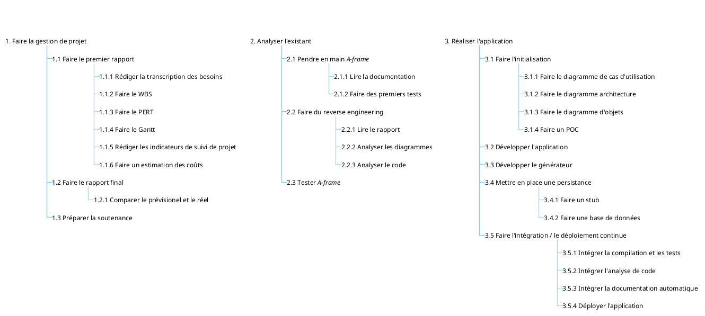

```plantuml

@startwbs

<style>
wbsDiagram {
  arrow {
    LineColor SkyBlue
  }
  :depth(0) {
      LineColor transparent
      FontColor transparent
  }
  arrow {
    :depth(2) {
      LineColor lightblue
    }
  } 
}
</style>
*_ wbs
**_ 1. Faire la gestion de projet
***_ 1.1 Faire le premier rapport
****_ 1.1.1 Rédiger la transcription des besoins
****_ 1.1.2 Faire le WBS
****_ 1.1.3 Faire le PERT
****_ 1.1.4 Faire le Gantt
****_ 1.1.5 Rédiger les indicateurs de suivi de projet 
****_ 1.1.6 Faire un estimation des coûts
***_ 1.2 Faire le rapport final
****_ 1.2.1 Comparer le prévisionel et le réel
***_ 1.3 Préparer la soutenance

**_ 2. Analyser l'existant
***_ 2.1 Pendre en main //A-frame//
****_ 2.1.1 Lire la documentation
****_ 2.1.2 Faire des premiers tests
***_ 2.2 Faire du reverse engineering
****_ 2.2.1 Lire le rapport
****_ 2.2.2 Analyser les diagrammes
****_ 2.2.3 Analyser le code
***_ 2.3 Tester //A-frame//

**_ 3. Réaliser l'application
***_ 3.1 Faire l'initialisation
****_ 3.1.1 Faire le diagramme de cas d'utilisation
****_ 3.1.2 Faire le diagramme architecture
****_ 3.1.3 Faire le diagramme d'objets
****_ 3.1.4 Faire un POC
***_ 3.2 Développer l'application
***_ 3.3 Développer le générateur
***_ 3.4 Mettre en place une persistance
****_ 3.4.1 Faire un stub
****_ 3.4.2 Faire une base de données
***_ 3.5 Faire l'intégration / le déploiement continue 
****_ 3.5.1 Intégrer la compilation et les tests
****_ 3.5.2 Intégrer l'analyse de code
****_ 3.5.3 Intégrer la documentation automatique
****_ 3.5.4 Déployer l'application 

@endwbs

```