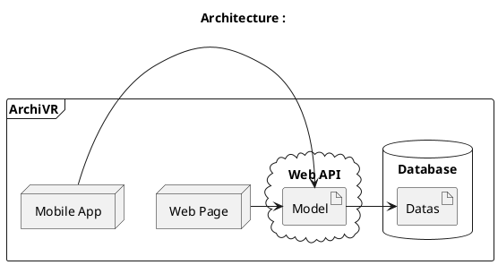

```plantuml
@startuml

title "Architecture :"

frame "ArchiVR" {

node web as "Web Page"

node mobile as "Mobile App"

database db as "Database"{
artifact Datas
}

cloud api as "Web API"{
artifact Model
}

web -> Model
mobile -> Model

Model -> Datas

}

@enduml
```