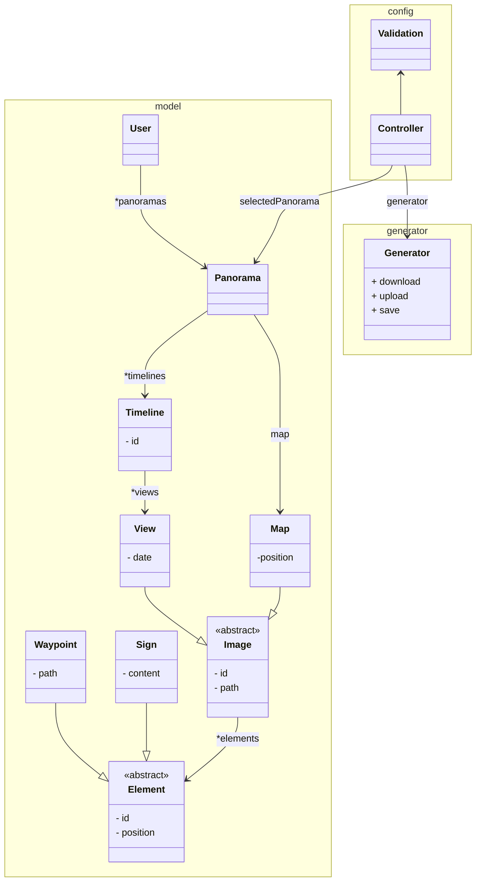

```mermaid
classDiagram
    
namespace config{
    class Validation
    class Controller
}
Validation <-- Controller

namespace model{
    class User{

    }
    class Panorama{

    }
    class Image{
        <<abstract>>
        - id
        - path
    }
    class View{
        - date
    }
    class Timeline{
        - id
    }
    class Map{
        -position
    }
    class Element{
        <<abstract>>
        - id
        - position
    }
    class Waypoint{
        - path
    }
    class Sign{
        - content
    }
}
User --> Panorama:*panoramas

View --|> Image
Map --|> Image
Waypoint --|> Element
Sign --|> Element

Image --> Element : *elements

Panorama --> Map: map
Timeline --> View : *views
Panorama --> Timeline : *timelines

Controller --> Panorama : selectedPanorama

namespace generator{
    class Generator{
        + download
        + upload
        + save
    }
}

Controller --> Generator : generator

```