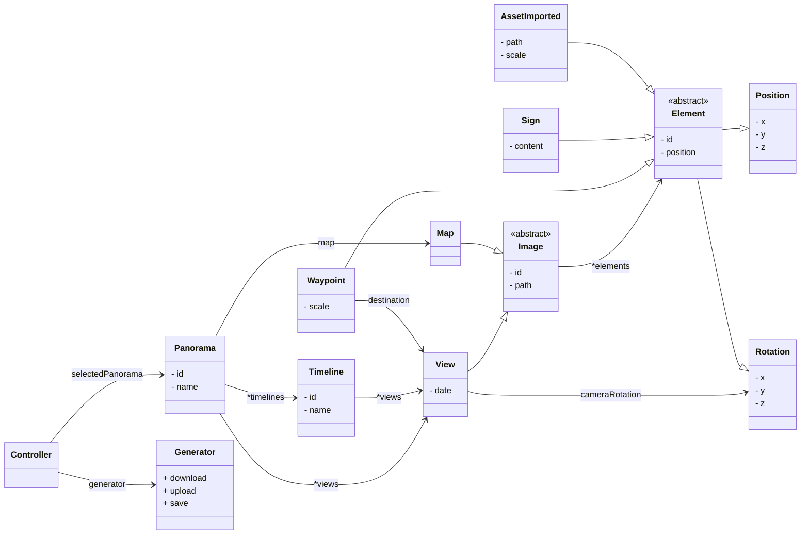

```mermaid
classDiagram

direction LR

class Controller

class Panorama{
    - id
    - name
}
class Image{
    <<abstract>>
    - id
    - path
}
class View{
    - date
}
class Timeline{
    - id
    - name
}
class Map{
    
}
class Element{
    <<abstract>>
    - id
    - position
}
class Waypoint{
    - scale
}
class Sign{
    - content
}
class AssetImported{
    - path
    - scale
}

class Position{
    - x
    - y
    - z
}
class Rotation{
    - x
    - y
    - z
}
class Generator{
    + download
    + upload
    + save
}

Controller --> Panorama : selectedPanorama
Controller --> Generator : generator

Panorama --> View: *views
Panorama --> Timeline : *timelines
Panorama --> Map: map

Timeline --> View : *views

Image --> Element : *elements

View --|> Image
View --> Rotation:cameraRotation

Map --|> Image

Waypoint --|> Element
Sign --|> Element
AssetImported --|> Element

Element --|> Position 
Element --|> Rotation

Waypoint --> View:destination

```
