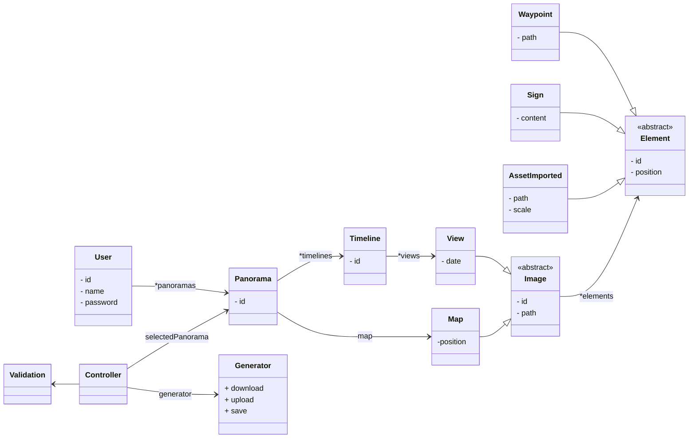

```mermaid
classDiagram

direction LR

class Validation
class Controller

Validation <-- Controller

class User{
    - id
    - name
    - password
}
class Panorama{
    - id
}
class Image{
    <<abstract>>
    - id
    - path
}
class View{
    - date
}
class Timeline{
    - id
}
class Map{
    -position
}
class Element{
    <<abstract>>
    - id
    - position
}
class Waypoint{
    - path
}
class Sign{
    - content
}
class AssetImported{
    - path
    - scale
}

User --> Panorama:*panoramas

View --|> Image
Map --|> Image
Waypoint --|> Element
Sign --|> Element
AssetImported --|> Element

Image --> Element : *elements

Panorama --> Map: map
Timeline --> View : *views
Panorama --> Timeline : *timelines

Controller --> Panorama : selectedPanorama

class Generator{
    + download
    + upload
    + save
}

Controller --> Generator : generator
```