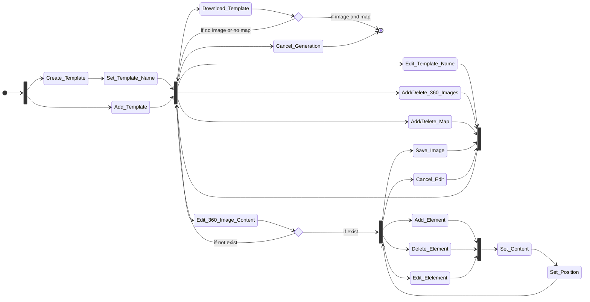

```mermaid

stateDiagram-v2

direction LR

state generate_project <<fork>>
    [*] --> generate_project
    generate_project --> Create_Template
    generate_project --> Add_Template
    Create_Template --> Set_Template_Name
    
state join_generate_project <<join>>
    
    Set_Template_Name --> join_generate_project
    Add_Template --> join_generate_project

state join_generate_project <<fork>>  
    join_generate_project --> Edit_Template_Name
    join_generate_project --> Add/Delete_360_Images
    join_generate_project --> Add/Delete_Map
    join_generate_project --> Edit_360_Image_Content

    join_generate_project --> Download_Template
    state if_download <<choice>>
        Download_Template --> if_download
        if_download --> [*] : if image and map
        if_download --> join_generate_project : if no image or no map

    join_generate_project --> Cancel_Generation
    Cancel_Generation --> [*]


state images_edition <<join>>  
    images_edition --> join_generate_project
    Edit_Template_Name --> images_edition
    Add/Delete_360_Images --> images_edition
    Add/Delete_Map --> images_edition


state if_editable <<choice>>
    Edit_360_Image_Content --> if_editable
    if_editable --> join_generate_project : if not exist
    
    state image_edition <<fork>>
    
    if_editable --> image_edition : if exist

    image_edition --> Save_Image
    Save_Image --> images_edition
    image_edition --> Cancel_Edit
    Cancel_Edit --> images_edition

    image_edition --> Add_Element
    image_edition --> Delete_Element
    image_edition --> Edit_Elelement

    state element_edition <<join>>

    Add_Element --> element_edition
    Delete_Element --> element_edition
    Edit_Elelement --> element_edition

    element_edition --> Set_Content
    Set_Content --> Set_Position
    Set_Position --> image_edition

```