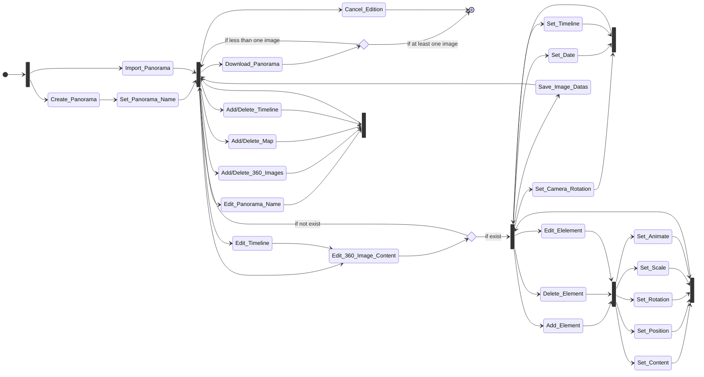

```mermaid

stateDiagram-v2

direction LR

state generate_project <<fork>>
    [*] --> generate_project
    generate_project --> Create_Panorama
    generate_project --> Import_Panorama
    Create_Panorama --> Set_Panorama_Name
    
state join_generate_project <<join>>
    
    Set_Panorama_Name --> join_generate_project
    Import_Panorama --> join_generate_project

state join_generate_project <<fork>>  
    join_generate_project --> Edit_Panorama_Name
    join_generate_project --> Add/Delete_360_Images
    join_generate_project --> Add/Delete_Map
    join_generate_project --> Edit_360_Image_Content
    join_generate_project --> Add/Delete_Timeline

    join_generate_project --> Edit_Timeline
    Edit_Timeline --> Edit_360_Image_Content

    join_generate_project --> Download_Panorama
    state if_download <<choice>>
        Download_Panorama --> if_download
        if_download --> [*] : if at least one image
        if_download --> join_generate_project : if less than one image

    join_generate_project --> Cancel_Edition
    Cancel_Edition --> [*]


state images_edition <<join>>  
    images_edition --> join_generate_project
    Edit_Panorama_Name --> images_edition
    Add/Delete_360_Images --> images_edition
    Add/Delete_Map --> images_edition
    Add/Delete_Timeline --> images_edition


state if_editable <<choice>>
    Edit_360_Image_Content --> if_editable
    if_editable --> join_generate_project : if not exist
    
    state image_edition <<fork>>
    
    if_editable --> image_edition : if exist

    image_edition --> Add_Element
    image_edition --> Delete_Element
    image_edition --> Edit_Elelement

    state end_image_edition <<join>>

    image_edition --> Save_Image_Datas
    image_edition --> Set_Camera_Rotation
    image_edition --> Set_Date
    image_edition --> Set_Timeline

    Save_Image_Datas --> join_generate_project

    Set_Camera_Rotation --> end_image_edition
    Set_Date --> end_image_edition
    Set_Timeline --> end_image_edition

    end_image_edition --> image_edition

    state element_edition <<join>>

    Add_Element --> element_edition
    Delete_Element --> element_edition
    Edit_Elelement --> element_edition

    state end_element_edition <<join>>

    element_edition --> Set_Content
    Set_Content --> end_element_edition 
    element_edition --> Set_Position
    Set_Position --> end_element_edition
    element_edition --> Set_Rotation
    Set_Rotation --> end_element_edition
    element_edition --> Set_Scale 
    Set_Scale --> end_element_edition
    element_edition --> Set_Animate
    Set_Animate --> end_element_edition

    end_element_edition --> image_edition

    


```
