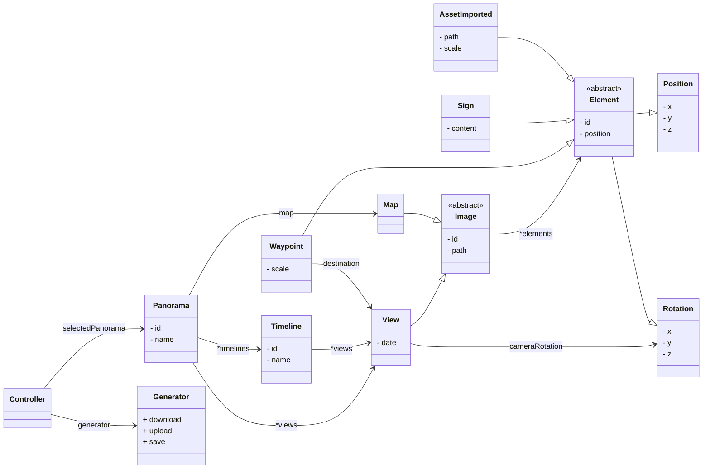
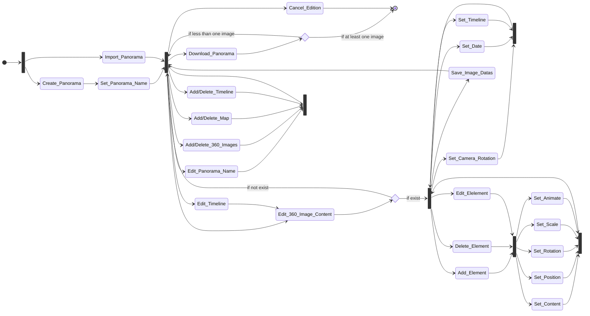

<div align="center">
    <h1>ArchiVR</h1>
    <h4>Documentation technique</h4>
</div>

_par ASTOLFI Vincent, JAULT Aurian et DE LA FUENTE Axel_

# Sommaire

- [Introduction](#introduction)
    - [Qu'est ce qu'Archivr ?](#qu’est-ce-qu’archivr)
    - [Les fonctionnalités](#les-fonctionnalités)   
- [Générateur (PHP)](#générateur-(php))
    - [Conception](#conception)
    - [Site web](#site-web)
    - [Algorithme de génération](#algorithme-de-génération)
- [Panorama (A-Frame)](#panorama-(a-frame))
- [Extras](#extras)
    - [Tests](#tests)
    - [Script Shell](#script-shell)
    - [Déploiement](#déploiement)
    - [Intégration continue](#intégration-continue)

# Introduction

### Qu'est ce qu'ArchiVR


Dans le cadre de l'événement de l'université Foraine à Brioude, plusieurs IUT participent à des projets régionaux, le but de notre projet a était de résoudre une des problématiques de la ville qui est de rendre accessible les lieux culturels de la commune à tous les usagers en utilisant la réalité virtuelle. Une partie de la solution a déjà été réalisée par un ancien groupe de l’IUT en 2021, il permet d’ajouter de nouvelles images 360° ainsi que de naviguer parmi les points proposés. Ce projet nous à été fourni afin de prolonger son développement ainsi que d’ajouter de nouvelles fonctionnalités notamment la capacité à choisir la temporalité du lieu que l’on visite. 
Actuellement, il comprend deux éléments; le panorama, une carte contenant plusieurs points d’intérêts autour de l’IUT. Il est possible de naviguer entre les différents lieux à l'aide de flèches rajouter sur les images.  
Le deuxième élément permet de générer le premier,c'est le générateur. il génére les images 360° compatibles avec la première partie, ainsi que d’ajouter des éléments interactifs. L’objectif principal de notre travail est de finaliser les éléments déjà créés.   
la principale fonctionnalité que nous avons implémenté est la notien de temporalité. En effet il est possible d'ajouter plusieur image pour un même lieux donné afin que les visiteurs pouissent voir un même lieu dans des contextes différents.

Lien vers l'ancien projet : [Ancien projet](https://codefirst.iut.uca.fr/git/archivr/old-project)

### Les fonctionnalités

**Créer un panorama :**

| Générateur   | Panorama
|--------------- |--------|
| Importer des images 360°   | Créer les animations et modèles 3D|
| Ajouter/Placer des panneaux                                                 |<div align="center">__X__</div> |
| Ajouter/Placer des points de navigations                           |<div align="center">__X__</div> |
| Ajouter/Placer ses propres modèles 3D                        |<div align="center">__X__</div> |
| Lier les points de navigation vers des images 360° _(ou timelines)_              |<div align="center">__X__</div> |
| Ajouter la carte                                                     |<div align="center">__X__</div> |
| Ajouter des points de navigation de la carte aux images 360° _(ou timelines)_    |<div align="center">__X__</div> |

**Timeline :**

| Générateur  | Panorama|
|-------------- |-----|
| Permettre à plusieurs photos d'être sur la même timeline | Modifier l'apparence de la scène en fonction de la temporalité (slider) |
|<div align="center">__X__</div> | Créer le slider et les animations de changement de temporalité|

**Ré-importer un panorama :**

| Générateur  | panorama |
|-------------- |--------|
| Édition (Ajouter / Supprimer / modifier) des éléments (photos, panneaux et points d'intérêts)    |<div align="center">__X__</div> |
| Modifier l'image de la carte et ses éléments                                                     |<div align="center">__X__</div> |
| Sauvegarder / annuler les modifications                                                          |<div align="center">__X__</div> |
| Créer un fichier JSON correspondant aux objets du Panorama créer | X |
| Importer ce fichier et recréer les objets en fonction | X |

**Implémentation des différents périphériques :**

Générateur| Panorama  |
|-------------- |-----|
|<div align="center">__X__</div> | Changement de la vue en fonction du périphériques    |
|<div align="center">__X__</div> | Implémenté la détection des manette d'Occulus    |

# Générateur (PHP)

## Conception

**Diagramme de classe :**



**Diagramme d'activité :**



## Site web

Le générateur a été codé en PHP, pour être utilisé comme application Web local. _(cf. [Déploiement](#déploiement))_

**Organisation du projet :**

Notre projet repose sur le patron MVC (_Model - View - Controller)_. N'ayant qu'un seul type d'utilisateur sur notre application, nous avons un seul et unique _Controller_. 

Le code source du générateur se trouve dans le répertoire `./src/`. Ce dernier contiens différents répertoires :

- `.template/` :

Contient tous les scripts `JS`, et template de pages `HTML` _(vues)_, utilisé lors de la génération d'un panorama.

- `businesses/` :

Contient les classes métiers du projet.

- `config/` :

Contient le fichier de configuration _(déclaration des constantes)_, ainsi que l'_Autoloder_, qui permet de charger automatiquement une seule fois toutes les classes du projet au lancement de l'application Web.

- `controller/` :

Contient le controleur du projet.

- `models/` :

Contient les classes modèles du projet

- `views/` :

Contient les vues du générateur. _(N.B. le style des vues à été majoritairement fait avec [Bootstrap](https://getbootstrap.com/))_

**L'UX :**

TODO()

**Quelques problèmes connus de notre projet :**

En ce qui concerne la ✨ _façon de coder_ ✨, nous utilisons les sessions dans la majorité de nos vues, sans faire de vérification de ce qu'il y'a dedans. Cette mauvaise pratique peut laisser place à de nombreux bugs. Il aurait fallu utiliser une classe métier de vérification du contenu du tableaux `$_SESSION[]`, pour ensuite utiliser des variables vérifiés dans les vues.

Si l'utilisateur importe deux fois la même image, cela peut créer des évenements imprévu durant l'utilisation de l'application. Au début, l'utilisateur aura seulement deux fois son image, sans problèmes (chacune une entité distinct avec ses propres éléments). Seulement si l'utilisateur souhaite ajouter une des deux images dans une _Timeline_, alors les deux images vont être ajoutés. Cela est causé par l'utilisation du nom de l'image pour ajouter dans une _Timeline_, plutôt qu'avec un _id_.

## Algorithme de génération

Une fois que l'utilisateur a créé son Panorama avec ses différentes scènes, timelines, éléments, map. Il peu générer son Panorama et ainsi télécherger le fichier zip de son projet.

Avant de le générer, il a la possibilté de choisir la page de départ parmi, soit une timeline, soit une de ses scènes. À l'heure actuelle, il n'est donc pas possible de démarrer directement sur la map. Une fonctionnalité qui pourrait être ajouté à l'avenir.

### Structure du Panorama Généré

Le projet généré est un site web composé de plusieurs pages, scripts et ressources. Nous avons décidé de disposer nos fichiers de la façon suivante : un index.html qui contient la seule et unique page qui sera chargé du projet. Dans l'ancien projet, pour chaque scène on avait une page différente qui se chargeais. Cela impliquait que la page rechargeait à chaque changement de scène ce qui avais pour effet de quitter le mode VR en mode casque notamment et qui rendait donc l'expérience utilisateur moins bonnes. Pour contrer ce problème, nous avons donc choisi d'avoir une seule et unique page chargée puis nous modifions directement le code de cette page en JavaScript afin de changer la scène (explication du changement de scène en JavaScript [plus bas](#navigation)).

En plus de la page d'index, nous ajoutons un dossier templates contenant tout le code des différentes scènes nous permettant ainsi d'effectuer le changement. Nous avons aussi un dossier pour les différents assets (images, modèle 3D, sons) et enfin un dossier contenant les scripts JS.

L'architecture finale du dossier généré et donc la suivante : 

    out
    ├── assets
    │   ├── images
    │   │   ├── image1.png
    │   │   └── image2.png
    │   ├── models
    │   │   └── model.gltf
    │   ├── sounds
    │   │   └── sound.mp4
    │   ├── styles
    │   │   └── style.css
    ├── scripts
    │   └── *.js
    ├── templates
    │   ├── page1.html
    │   ├── page2.html
    │   └── map.html
    ├── index.html
    ├── five-server.config.js
    └── .holder.json

L'intéré des fichiers `five-server.config.js` et `.holder.json` est expliqué plus bas

### Création des scènes en html

Afin de créer les scènes html, on récupère donc les différents objets créés par l'utilisateur puis pour chacun de ces objets on créer des strings reprenant les informations importantes choisi et enfin, on ajoute chacun de ces éléments dans le fichier correspondant.

Par exemple si on veut générer un panneau dans une scène :

```php
$body .= '
    <a-entity position="'.strval($element->getPosition()).'" rotation="' . strval($element->getRotation()) . '" text="value: '.$element->getContent().'; align: center" animationcustom"></a-entity>
';
```

On stock donc notre élément dans une variable `$element` et on récupère les informations qu'il contient grâce aux méthodes lié présente dans la classe métier. 

Chaque type d'objet (panneau, point de navigation, élément 3D) doit générer une `a-entity` différente. Donc, quand on itère à travers chaque objet présent dans les différentes scène, on vérifie d'abord la classe de celui-ci puis on génère le code associé.

De plus, certains éléments change en focntion du type de scène généré (timeline, scène basique, map). Donc, quand on itère dans les objets présent dans le panorama, en focntion de leurs type on appelle différentes méthodes.

    scène basique -> fucntion generateBase()
    timeline      -> fucntion generateTimeline()
    map           -> function generateMap()

Les éléments qui changent en fonction du type de scène sont, dans la plupart des cas, l'affichage de bouton lié à la navigation entre scène. Par exemple, dans le cas d'une timeline qu'on utiliserai sur mobile, il faut afficher des boutons sur la scène qui vont permettre la navigation entre les différentes temporalité de la timeline. On rajoute donc le bout de code suivant au début de la template html lié à la timeline :

```php
$classNumber = 1;
foreach($timeline->getViews() as $view){
    $body .= '<button class="button-74" role="button" onclick="mobileOpacityHandler(\'class' . $classNumber . '\')" id="button' . $classNumber .'">' . $view->getDate() . '</button>';
    $vr_button .= 'class' . $classNumber . ': ' . $view->getDate() . ';';
    $classNumber++;
}
```

De plus, on va aussi ajouter des classes et paramètre aux différents éléments de la scène en focntion du type de celle-ci.

### Modification des scripts JavaScript

Les scripts JavaScript nécessaire ont été créés indépendamment du générateur et son expliqué [plus bas](#panorama-a-frame). Il faut donc, lors de la génération, simplement modifier certaine ligne de ces script afin de les rendres dynamique en fonction des éléments choisi par l'utilisateur. Par exemple, un des scripts permet d'accéder à la carte si le projet en possède une. Le script permet donc d'y accéder de différentes manières en fonction du périphérique sur lequel le projet est utilisé. Par exemple, sur ordinateur, on y accède grâce à la touche `M`.

Pour modifier le fichier vers lequel on navigue lors de la pression sur la touche, on récupère le fichier JavaScript qui possède la fonction en question puis on modifie les lignes nécessaire avec les bonnes informations. Par exemple : 

```php
$data = file('./.datas/out/scripts/computerSliderComponent.js');
$data[47] = 'goTo("./templates/'.$map->name.'","0 0 0")';
$data[71] = 'goTo("./.templates/'.$map->name.'","0 0 0")';
file_put_contents('./.datas/out/scripts/computerSliderComponent.js', $data);
```

### Importation d'ancien Panorama 

Une des fonctionnalités importante du projet était de pouvoir importer un de ses anciens projet à l'aide d'un fichier qui stockerai toute les informations importantes sur un Panorama.

Nous avons donc implémenter dans le générateur la création d'un ficheir json qui sauvegarde les données des différents objets créés par l'utilisateur. Pour ce faire, toute nos classes métier implémente l'interface `JsonSerializable` ainsi donc que la fonction suivante

```php
public function jsonSerialize(): array
{
    return get_object_vars($this);
}
```

Cette fonction permet donc de créer un tableau format json contenant toute les informations de l'objet lorsqu'on appelle la fonction `json_encode` sur l'objet. Étant donné que dans notre architecture tout les objets sont des attributs d'un objet Panorama, il nous suffit de faire le json_encode de celui ci afin de transformer tout les autres objets quand il le fera pour le Panorama.

```php
$json = json_encode($panorama, JSON_PRETTY_PRINT | JSON_UNESCAPED_UNICODE);
```

Nous obtenons alors un fichier JSON contenant les informations du projet de la forme suivante.

```json
{
    "id": "dqdz659c1817ab68c7.50113935",
    "name": "dqdz",
    "map": null,
    "timelines": [],
    "views": [
        {
            "path": "412974929_2333056303551950_1491315192000080061_n.jpg",
            "elements": [],
            "date": null,
            "cameraRotation": {
                "x": 0,
                "y": 0,
                "z": 0
            }
        }
    ]
}
```

Enfin, nous avons implémenté une fonction permettant de faire le travail dans l'autre sens. C'est à dire, que en important ce fichier json dans le site, nous pouvons recréer les différents objets de notre Panorama avec tout leurs attributs. Pour se faire, il existe une fonction déjà implémenté par PHP qui permet de transformer du JSON en objet. Cependant, étant donné que certain objets de notre architecture possède eux même d'autre objets, il est important de les créer dans le bon ordre. C'est pourquoi, nous avons été obligé de refaire nous même cette implémentation afin de controler l'ordre de création et ainsi éviter qui l'application ne soit pas focntionelle.

Par exmple, si on créer une scène qui possède un waypoint on doit aussi avoir créer l'objet de la scène vers laquelle le waypoint amène. Cela implique que nous devons d'abord créer toute nos scènes complètement vide puis tout les éléments qui les composants puis mettre ces composants dans les scènes correspondantes. 

La fonction permettant de faire ce travail est `loadFromFile` de la classe `GeneratorPanorama`. Elle nécessite de devoir être tenu à jour pour chaque ajout de fonctionnalitées. 

La fonction est divisée en plusieurs étapes qui permettent de créer les différents objets et de les ajouter les uns les autres. Chaque étape est précédé d'un commentaire expliquant à quoi elle sert. 

Cette partie du projet reste grandement améliorable notamment en créant un véritable parser qui serai plus optimisé et plus facile à maintenir. 

# Panorama ([A-Frame](https://aframe.io/))

🚧 La balise `a-entity` qui contient la scène à affiché doit avoir l'id `base` 🚧 

### Liste des fonctionnalités dans le panorama 

(_N.B. elles ne sont pas toutes implémentés dans le générateur_)

🟢 : implémenté / 🔴 : non-implémenté

- [Ajouter des panneaux avec du texte](#élément-texte) 🟢
- [Ajouter des audios (format mp3)](#élément-audio) 🔴
- [Faire apparaitre des éléments](#apparition-d’éléments) 🟢  
    - [En regardant une zone définie dans la vue](#fuse-control) 🟢
    - [En cliquant sur un élément](#apparition-au-clique) 🟢
- [Ajouter des éléments 3D animés](#élément-3d) 🟢
- [Ajouter différentes temporalités dans un lieux](#temporalité) 🟢
- [Support des casques VR, Téléphone et ordinateur](#support-des-appareils) 🟢
- [Naviguer entre les lieux](#navigation) 🟢
- [Fonctionnalités supplémentaires](#fonctionnalités-supplémentaires) 🟢

### Élément texte
Permet d'afficher du text sur une vue. Il est possible de faire en sorte que le texte soit tout le temps tourné vers l'utilisateur en utilisant le composant `look-at="#camera"`.

**Exemple :**

On ajoute le texte dans un élément `a-plane` afin de s'assurer qu'il soit visible tout le temps
```html
<a-plane color="black" width="5" text="value: Amphi A;  align: center" position="0 1 1" look-at="#camera"></a-plane>
```
### Élément audio
Permet de lire des fichiers mp3 lorsqu'on appuie sur un élément.


- **`soundhandler(this,src)`** doit-être ajouté à l'évènement `onclick` de l'élément. `src` correspond au chemin vers le fichier mp3 à lire. Si l'utilisateur appuie une seconde fois sur le bouton, le son s'arrête et rependra du début s'il réappuie dessus. Si il appuie sur un deuxième bouton pendant qu'un audio est lancé, cela coupe l'audio en cours et lance celui sélectionné.

**Exemple :**

```html
      <a-box 
      position="1 1 -4"
      color="brown"
      onclick="soundhandler(this,'./assets/dualipa.mp3')"></a-box>
```

### Apparition d'éléments

Il est possible de faire deux types d'animation d'apparition. En [cliquant sur un élément déjà présent](#apparition-au-clique) ou en regardant une [zone prédéfinie](#fuse-control).
### Apparition au clique

- **`Houdini` (component)** permet d'ajouter un booléen dans l'élement qui possède ce composant. Il permet de savoir s'il faut afficher ou cacher les éléments. Les élements apparaissant doivent avoir la __même__ classe que le bouton le déclanchant ainsi que d'une __opacité__ de 0.0.

- **`Onclick` (event)** permet de déclancher l'apparition des éléments. en appelant la fonction `clickHandler(this)` qui gère le changement d'opacité.

**Exemple :**

Cet exemple utilise des `a-box` comme éléments, mais le composant peut être affecté à n'importe quel élement possédant l'évènement `onclick`.

```html
<a-box houdini class="toto" position="0 0 -4" onclick="clickHandler(this)" color="blue"></a-box>
      <a-box class="toto" color="blue" position ="0 2 -3" opacity="0.0"></a-box>
```

### Fuse control

Permet de faire apparaitre des éléments en regardant un endroit dans l'image. Pour que cela fonctionne, il faut créer une balise `<a-plane rotation="0 90 0" opacity="0.0">` avec une opacité de 0.0 pour qu'il soit invisible. Lorsque l'utilisateur regarde vers cet éléments il déclanche l'apparition des éléments avec les évènements `onmouseenter` et `onmouseleave` quand il ne regarde plus. Pour que cela fonctionne, il faut ajouter la balise `cursor` dans la camera du joueur.

### Fades (Component)
__Un nom de classe = 1 panneau d'affichage.__   
Met l'opacité des éléments à 0 (invisible) et l'ajoute dans la classe `.default` si aucune n'est renseignée.  
🛑 Si il y a plusieur panneaux à afficher, changez les classes 🛑 

**`FadeIn('classe')` / `FadeOut('classe')` :**
- `FadeIn()` : Doit-être ajoutée dans l'évènement `onmouseenter` du `a-plane`
- `FadeOut()` : Doit-être ajoutée dans l'évènement `onmouleave` du `a-plane`

**Exemple :**

```html 
<a-plane 
      position="1 1 -4"
      color="brown"
      rotation="0 90 0"
      opacity="0.0"
      onmouseenter="fadeIn('classeObject1')"
      onmouseleave="fadeOut('classeObject1')"
      ></a-plane>
```

### Élément 3D

Il suffit de créer une balise `a-entity` et d'ajouter le composant `gltf-model='source du fichier'` (marche pour les models gltf __ET__ glb)

**Exemple :**
```html
<a-entity gltf-model="./assets/sign.glb" position="0 0 -1"></a-entity>
```

### Temporalité

- **`document.addEventListener(keydown,...)`** ajoute l'évènement `keydown` (qui détecte lorsqu'une touche est appuyée et/ou maintenue) à tout le document HTML.  
Il y a une valeur minimale et maximale qui borne les valeurs du "slider". Avec les touches ⬅️ et ➡️, on peut varier l'opacité des `a-sky` et changer de temporalités. L'évènement, utilise les fonctions :  
    - `function changeOpa2pics(value)`
    - `function changeOpa3pics(value)`
    - `function changeOpa4pics(value)`  

En fonction du nombre de balise contenant le composant `sliderelement`, l'évènements appel une fonction différentes. Par exemple, s'il y a 3 temporalités différentes, alors il appellera la fonction `changeOpa3pics`.  

---

Toutes les plateformes sont supportées, pour le casque VR, l'évenement `keyDown` prend en compte le joystick __gauche__ pour le slider. Enfin, pour les smartphones, des boutons apparessen, chacun redirigeant vers une temporalité.

- **`sliderelement` (Component)** ajoute dans le tableau `arrayViews` l'élément HTML contenant le composant. Cela permettra d'accéder au différentes temporalités.

🛑 Bien mettre dans l'ordre du plus récent au plus vieux dans le html sinon ça ne s'affichera pas dans le bon ordre. 🛑  

**Contrainte :**
* Pour disposer des éléments dans des temporalités différentes, il faut assigner  __PAR TEMPORALITÉS__ une classe différentes à  __chaque éléments__
* Les éléments que vous souhaitez montrer lorsque l'on arrive sur cette vue doivent avoir une opacité de 1.0 (par défaut), le reste des éléments doivent avoir une opacité de 0.0 (__OBLIGATOIRE__)

**Exemple :**
```html 
<a-entity id="base">
  <a-sky src="assets/paul-szewczyk-GfXqtWmiuDI-unsplash.jpg" class="premiereTemporatlite" ></a-sky>
    <a-box class="premiereTemporatlite" color="purple"></a-box
  <a-sky src="assets/timothy-oldfield-luufnHoChRU-unsplash (1).jpg" classe="deuxieme" opacity="0.0"></a-sky>
    <a-box class="deuxieme" color="red"></a-box
  <a-sky src="assets/kris-guico-rsB-he-ye7w-unsplash.jpg" class="troisieme" opacity="0.0"></a-sky>
    <a-box class="troisieme" color="blue"></a-box
  <a-sky src="assets/alex-bdnr-GNNoZa8zVwY-unsplash.jpg" class="quatrieme" opacity="0.0"></a-sky>
</a-entity>
```
<u>Bouttons pour les smartphone</u>

```html
<div class="hud" id="div">
      <button class="button-74" role="button" onclick="mobileOpacityHandler('premiereTemporatlite')"></button>
      <button class="button-74" role="button" onclick="mobileOpacityHandler('deuxieme')"></button>
      <button class="button-74" role="button" onclick="mobileOpacityHandler('troisieme')"></button>
      <button class="button-74" role="button" onclick="mobileOpacityHandler('quatrieme')"></button>
    </div>
```
### Support des appareils

- **`Scene` (Component)** permet d'inclure des fonctions, évènements et éléments en fonction du support utilisé.

- **`ComputerComponent()`** ajoute le panneau indiquant les touches de contrôles

- **`mobileComponent()`** ajoute le fichier css permettant d'afficher les boutons pour naviguer entre les temporalités (si il y en a) ainsi que l'accès à la carte.

- **`addPanel()`** permet d'ajouter le panneau des contrôles si un casque vr est utilisé, cette fonction est utilisée dans `ComputerComponent` et `mobileComponent` car le support détecté change en fonction du type de navigateur utilisé.

### Navigation

**`goTo('pathToHTMLContent','CameraRotation')`** est a mettre dans l'èvenement `onclick` de l'élément souhaité. Permet de changer de vue et change l'orientation de la caméra (set à '0 0 0' par défaut)

**Exemple :** 
```html 
<a-box color="pink" position="0 1 -3" onclick="goTo('ficher.html','8 25 0')"  animationcustom>
</a-box>
```

### Fonctionnalités supplémentaires

**`animationcustom` (Component)** est a ajouter à TOUS les éléments visibles (sky compris). Permet de faire une animation de *fadeIn* lorsque l'on accède à une vue.

**Exemple :**

```html
<a-plane   animationcustom color="black" width="5" text="value: Amphi A;  align: center" position="0 1 1"></a-plane>
```

# Extras

### Tests

Notre projet possède un jeu de test sur les classes métiers et les classes modèles. La couverture de test de ces classes est de 80%.

Les tests sont tous dans le répertoires `./tests/` (à la racine du projet). Un répertoire `config/` ce trouve avec les tests, il contient un _Autoloader_ (`TestsAutoload.php`), permettant de charger automatiquement les classes pour les tests.

Pour réaliser nos tests nous avons utilisé **[PHPUnit](https://phpunit.de/)**. Le script pour lancer les tests est disponible à la racine du projet, en éxécutant : `./phpunit`

Ce dernier possède son fichier de configuration `phpunit.xml`. Il est configuré pour tester toutes les classes (modèles et métiers) de notre projet.

_Le script génère aussi un_ `reports.xml` _permettant d'obtenir toutes les informations sur les tests effectuer. Il est possible de l'analyser à l'aide d'outils, tel que_ **[SonarQube](https://www.sonarsource.com/)**.

### Script shell

À la racine du projet, un script "`./3d-models-support.sh`" est disponible.

Ce script permet de mettre à jour les valeurs suivantes de votre `php.ini` :

```
upload_max_filesize=20M
post_max_size=21M
```

La modification de ces valeurs est requise seulement si vous souhaitez importer vos propres modèles 3D (.gltf). Ces modèles 3D sont trop lourd pour être importer par PHP avec les valeurs par défauts.

Pour utiliser le script :

```shell
sudo ./3d-models-support.sh
```

Pour connaître le path de votre `php.ini`

```shell
php --ini
```

### Déploiement

Suite à des performances insatisfaisantes lors de l'importation d'images et de modèles 3D depuis notre serveur, nous avons pris la décision de limiter l'utilisation de notre application web exclusivement en local, sur l'ordinateur de chaque utilisateur. Nous avons pris cette décision car nous avons constaté une grande lenteure lors de l'importation des images ou modèles 3D vers le serveur, compromettant ainsi l'expérience utilisateur.

_Pour l'utilisation du générateur en local :_

```shell
php -S 127.0.0.1:8000 -t ./archivr/src/
```

Une fois un panorama généré, ce dernier peut être déployé sans problème sur un serveur, et accédé par PC, mobile et casque VR.

### Intégration continue

Notre projet possède une intégration continue. Cette dernière permet de lancer les tests sur les classes, ainsi que d'analyser le `reports.xml`, avec **[SonarQube](https://www.sonarsource.com/)**.

Le code est disponible dans le fichier : `.drone.star` _(écrit en [Starlark](https://docs.drone.io/pipeline/scripting/starlark/))_

Des jobs de déploiement sont écrits, mais ils ne sont jamais lancés car, comme vu plus tot, nous avons décidé de ne pas déployer le générateur.
