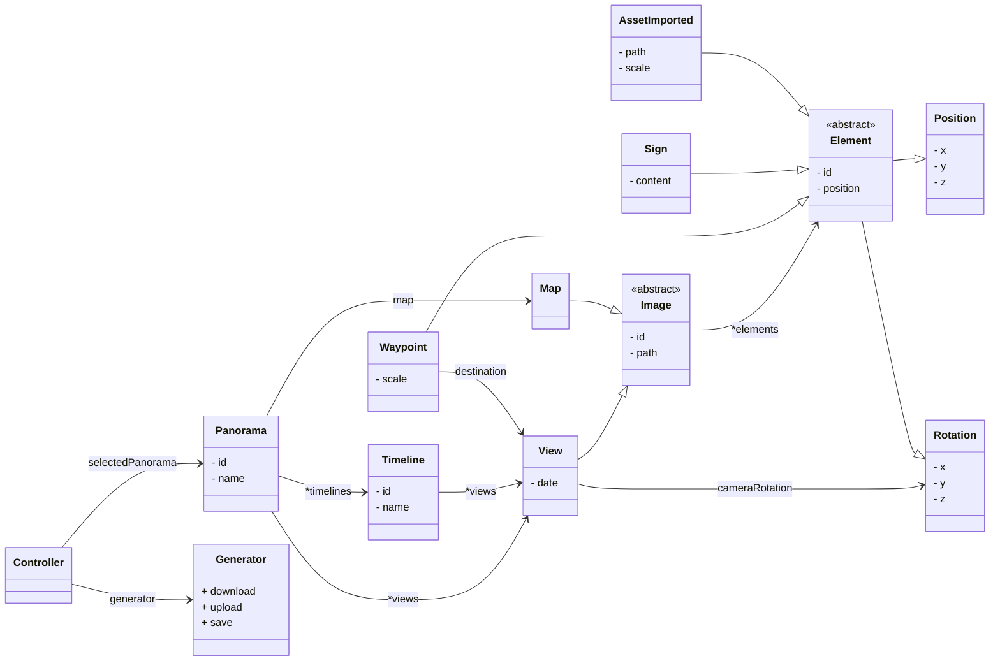

<div align="center">
    <h1>ArchiVR</h1>
    <h4>Documentation technique</h4>
</div>

_par ASTOLFI Vincent, JAULT Aurian et DE LA FUENTE Axel_

# Sommaire

- [Introduction](#introduction)
    - [Qu'est ce qu'Archivr ?](#qu’est-ce-qu’archivr-%3F)
    - [Les fonctionnalités](#les-fonctionnalités)   
- [Générateuri (PHP)](#générateur-(php))
    - [Conception](#conception)
    - [Site web](#site-web)
    - [Algorithme de génération](#algorithme-de-génération)
- [Panorama (A-Frame)](#panorama-(a-frame))
- [Extras](#extras)
    - [Tests](#tests)
    - [Script Shell](#script-shell)
    - [Déploiement](#déploiement)

# Introduction

### Qu'est ce qu'ArchiVR ?

Notre projet repose sur un projet éxistant, réalisée par un ancien groupe de l’IUT en 2021. Ce dernier permet d’ajouter de nouvelles images 360° ainsi que de naviguer parmi les points proposés. Ce projet nous à été fourni afin de prolonger son développement ainsi que d’ajouter de nouvelles fonctionnalités notamment la capacité à choisir la temporalité du lieu que l’on visite. Actuellement, le générateur, permet de d'ajouter des images 360°, une carte, ainsi que d’ajouter des éléments interactifs. L’objectif principal de notre travail est de finaliser les éléments déjà créés. Notre client, Monsieur Salva, souahite de plus une amélioration du visuel de l’application se rapprochant d’un résultat professionnel. Comme cité précédemment, la possibilité de choisir la temporalité de lieu que l’on visite est une fonctionnalité clé de l’application car elle s’imbrique directement à notre contexte initial qui est de réaliser des visites de lieux historiques de la ville de Brioude.

Lien vers l'ancien projet : [Ancien projet](https://codefirst.iut.uca.fr/git/archivr/old-project)

### Les fonctionnalités

**Créer un panorama :**

| Générateur   | Panorama
|--------------- |--------|
| Importer des images 360°   | Créer les animations et modèles 3D|
| Ajouter/Placer des panneaux                                                 |<div align="center">__X__</div> |
| Ajouter/Placer des points de navigations                           |<div align="center">__X__</div> |
| Lier les points de navigation vers des images 360° _(ou timelines)_              |<div align="center">__X__</div> |
| Ajouter la carte                                                     |<div align="center">__X__</div> |
| Ajouter des points de navigation de la carte aux images 360° _(ou timelines)_    |<div align="center">__X__</div> |
| Importer et placer ses propres modèles 3D                        |<div align="center">__X__</div> |

**Timeline :**

| Générateur  | Panorama|
|-------------- |-----|
| Permettre à plusieurs photos d'être sur la même timeline | Modifier l'apparence de la scène en fonction de la temporalité (slider) |
|<div align="center">__X__</div> | Créer le slider et les animations de changement de temporalité|

**Ré-importer un panorama :**

| Générateur  | panorama |
|-------------- |--------|
| Édition (Ajouter / Supprimer / modifier) des éléments (photos, panneaux et points d'intérêts)    |<div align="center">__X__</div> |
| Modifier l'image de la carte et ses éléments                                                     |<div align="center">__X__</div> |
| Sauvegarder / annuler les modifications                                                          |<div align="center">__X__</div> |

**Implémentation des différents périphériques :**

Générateur| Panorama  |
|-------------- |-----|
|<div align="center">__X__</div> | Changement de la vue en fonction du périphériques    |
|<div align="center">__X__</div> | Implémenté la détection des manette d'Occulus    |

# Générateur (PHP)

### Conception

**Diagramme de classe :**



**Diagramme d'activité :**


### Site web

### Algorithme de génération

# Panorama ([A-Frame](https://aframe.io/))

🚧 La balise `a-entity` qui contient la scène à affiché doit avoir l'id `base` 🚧 

### Liste des fonctionnalités dans le panorama 

(_N.B. elles ne sont pas toutes implémentés dans le générateur_)

🟢 : implémenté / 🔴 : non-implémenté

- [Ajouter des panneaux avec du texte](#élément-texte) 🟢
- [Ajouter des audios (format mp3)](#élément-audio) 🔴
- [Faire apparaitre des éléments](#apparition-d’éléments) 🟢  
    - [En regardant une zone définie dans la vue](#fuse-control) 🟢
    - [En cliquant sur un élément](#apparition-au-clique) 🟢
- [Ajouter des éléments 3D animés](#élément-3d) 🟢
- [Ajouter différentes temporalités dans un lieux](#temporalité) 🟢
- [Support des casques VR, Téléphone et ordinateur](#support-des-appareils) 🟢
- [Naviguer entre les lieux](#navigation) 🟢
- [Fonctionnalités supplémentaires](#fonctionnalités-supplémentaires) 🟢

### Élément texte
Permet d'afficher du text sur une vue. Il est possible de faire en sorte que le texte soit tout le temps tourné vers l'utilisateur en utilisant le composant `look-at="#camera"`.

**Exemple :**

On ajoute le texte dans un élément `a-plane` afin de s'assurer qu'il soit visible tout le temps
```html
<a-plane color="black" width="5" text="value: Amphi A;  align: center" position="0 1 1" look-at="#camera"></a-plane>
```
### Élément audio
Permet de lire des fichiers mp3 lorsqu'on appuie sur un élément.


- **`soundhandler(this,src)`** doit-être ajouté à l'évènement `onclick` de l'élément. `src` correspond au chemin vers le fichier mp3 à lire. Si l'utilisateur appuie une seconde fois sur le bouton, le son s'arrête et rependra du début s'il réappuie dessus. Si il appuie sur un deuxième bouton pendant qu'un audio est lancé, cela coupe l'audio en cours et lance celui sélectionné.

**Exemple :**

```html
      <a-box 
      position="1 1 -4"
      color="brown"
      onclick="soundhandler(this,'./assets/dualipa.mp3')"></a-box>
```

### Apparition d'éléments

Il est possible de faire deux types d'animation d'apparition. En [cliquant sur un élément déjà présent](#apparition-au-clique) ou en regardant une [zone prédéfinie](#fuse-control).
### Apparition au clique

- **`Houdini` (component)** permet d'ajouter un booléen dans l'élement qui possède ce composant. Il permet de savoir s'il faut afficher ou cacher les éléments. Les élements apparaissant doivent avoir la __même__ classe que le bouton le déclanchant ainsi que d'une __opacité__ de 0.0.

- **`Onclick` (event)** permet de déclancher l'apparition des éléments. en appelant la fonction `clickHandler(this)` qui gère le changement d'opacité.

**Exemple :**

Cet exemple utilise des `a-box` comme éléments, mais le composant peut être affecté à n'importe quel élement possédant l'évènement `onclick`.

```html
<a-box houdini class="toto" position="0 0 -4" onclick="clickHandler(this)" color="blue"></a-box>
      <a-box class="toto" color="blue" position ="0 2 -3" opacity="0.0"></a-box>
```

### Fuse control

Permet de faire apparaitre des éléments en regardant un endroit dans l'image. Pour que cela fonctionne, il faut créer une balise `<a-plane rotation="0 90 0" opacity="0.0">` avec une opacité de 0.0 pour qu'il soit invisible. Lorsque l'utilisateur regarde vers cet éléments il déclanche l'apparition des éléments avec les évènements `onmouseenter` et `onmouseleave` quand il ne regarde plus. Pour que cela fonctionne, il faut ajouter la balise `cursor` dans la camera du joueur.

### Fades (Component)
__Un nom de classe = 1 panneau d'affichage.__   
Met l'opacité des éléments à 0 (invisible) et l'ajoute dans la classe `.default` si aucune n'est renseignée.  
🛑 Si il y a plusieur panneaux à afficher, changez les classes 🛑 

**`FadeIn('classe')` / `FadeOut('classe')` :**
- `FadeIn()` : Doit-être ajoutée dans l'évènement `onmouseenter` du `a-plane`
- `FadeOut()` : Doit-être ajoutée dans l'évènement `onmouleave` du `a-plane`

**Exemple :**

```html 
<a-plane 
      position="1 1 -4"
      color="brown"
      rotation="0 90 0"
      opacity="0.0"
      onmouseenter="fadeIn('classeObject1')"
      onmouseleave="fadeOut('classeObject1')"
      ></a-plane>
```

### Élément 3D

Il suffit de créer une balise `a-entity` et d'ajouter le composant `gltf-model='source du fichier'` (marche pour les models gltf __ET__ glb)

**Exemple :**
```html
<a-entity gltf-model="./assets/sign.glb" position="0 0 -1"></a-entity>
```

### Temporalité

- **`document.addEventListener(keydown,...)`** ajoute l'évènement `keydown` (qui détecte lorsqu'une touche est appuyée et/ou maintenue) à tout le document HTML.  
Il y a une valeur minimale et maximale qui borne les valeurs du "slider". Avec les touches ⬅️ et ➡️, on peut varier l'opacité des `a-sky` et changer de temporalités. L'évènement, utilise les fonctions :  
    - `function changeOpa2pics(value)`
    - `function changeOpa3pics(value)`
    - `function changeOpa4pics(value)`  

En fonction du nombre de balise contenant le composant `sliderelement`, l'évènements appel une fonction différentes. Par exemple, s'il y a 3 temporalités différentes, alors il appellera la fonction `changeOpa3pics`.  

---

Toutes les plateformes sont supportées, pour le casque VR, l'évenement `keyDown` prend en compte le joystick __gauche__ pour le slider. Enfin, pour les smartphones, des boutons apparessen, chacun redirigeant vers une temporalité.

- **`sliderelement` (Component)** ajoute dans le tableau `arrayViews` l'élément HTML contenant le composant. Cela permettra d'accéder au différentes temporalités.

🛑 Bien mettre dans l'ordre du plus récent au plus vieux dans le html sinon ça ne s'affichera pas dans le bon ordre. 🛑  

**Contrainte :**
* Pour disposer des éléments dans des temporalités différentes, il faut assigner  __PAR TEMPORALITÉS__ une classe différentes à  __chaque éléments__
* Les éléments que vous souhaitez montrer lorsque l'on arrive sur cette vue doivent avoir une opacité de 1.0 (par défaut), le reste des éléments doivent avoir une opacité de 0.0 (__OBLIGATOIRE__)

**Exemple :**
```html 
<a-entity id="base">
  <a-sky src="assets/paul-szewczyk-GfXqtWmiuDI-unsplash.jpg" class="premiereTemporatlite" ></a-sky>
    <a-box class="premiereTemporatlite" color="purple"></a-box
  <a-sky src="assets/timothy-oldfield-luufnHoChRU-unsplash (1).jpg" classe="deuxieme" opacity="0.0"></a-sky>
    <a-box class="deuxieme" color="red"></a-box
  <a-sky src="assets/kris-guico-rsB-he-ye7w-unsplash.jpg" class="troisieme" opacity="0.0"></a-sky>
    <a-box class="troisieme" color="blue"></a-box
  <a-sky src="assets/alex-bdnr-GNNoZa8zVwY-unsplash.jpg" class="quatrieme" opacity="0.0"></a-sky>
</a-entity>
```
<u>Bouttons pour les smartphone</u>

```html
<div class="hud" id="div">
      <button class="button-74" role="button" onclick="mobileOpacityHandler('premiereTemporatlite')"></button>
      <button class="button-74" role="button" onclick="mobileOpacityHandler('deuxieme')"></button>
      <button class="button-74" role="button" onclick="mobileOpacityHandler('troisieme')"></button>
      <button class="button-74" role="button" onclick="mobileOpacityHandler('quatrieme')"></button>
    </div>
```
### Support des appareils

- **`Scene (Component)`** permet d'inclure des fonctions, évènements et éléments en fonction du support utilisé.

- **`ComputerComponent()`** ajoute le panneau indiquant les touches de contrôles

- **`mobileComponent()`** ajoute le fichier css permettant d'afficher les boutons pour naviguer entre les temporalités (si il y en a) ainsi que l'accès à la carte.

- **`addPanel()`** permet d'ajouter le panneau des contrôles si un casque vr est utilisé, cette fonction est utilisée dans `ComputerComponent` et `mobileComponent` car le support détecté change en fonction du type de navigateur utilisé.

### Navigation

**`goTo('pathToHTMLContent','CameraRotation')`** est a mettre dans l'èvenement `onclick` de l'élément souhaité. Permet de changer de vue et change l'orientation de la caméra (set à '0 0 0' par défaut)

**Exemple :** 
```html 
<a-box color="pink" position="0 1 -3" onclick="goTo('ficher.html','8 25 0')"  animationcustom>
</a-box>
```

### Fonctionnalités supplémentaires

**`animationcustom` (Component)** est a ajouter à TOUS les éléments visibles (sky compris). Permet de faire une animation de *fadeIn* lorsque l'on accède à une vue.

**Exemple :**

```html
<a-plane   animationcustom color="black" width="5" text="value: Amphi A;  align: center" position="0 1 1"></a-plane>
```

# Extras

### Tests

Notre projet possède un jeu de test sur les classes métiers et les classes modèles. La couverture de test de ces classes est de 80%.

Les tests sont tous dans le répertoires `./tests/` (à la racine du projet). Un répertoire `config/` ce trouve avec les tests, il contient un _Autoloader_ (`TestsAutoload.php`), permettant de charger automatiquement les classes pour les tests.

Pour réaliser nos tests nous avons utilisé **[PHPUnit](https://phpunit.de/)**. Le script pour lancer les tests est disponible à la racine du projet, en éxécutant : `./phpunit`

Ce dernier possède son fichier de configuration `phpunit.xml`. Il est configuré pour tester toutes les classes (modèles et métiers) de notre projet.

_Le script génère aussi un_ `reports.xml` _permettant d'obtenir toutes les informations sur les tests effectuer. Il est possible de l'analyser à l'aide d'outils, tel que_ **[SonarQube](https://www.sonarsource.com/)**.

### Script shell

À la racine du projet, un script "`./3d-models-support.sh`" est disponible.

### Déploiement

Nous avions pour idée initial de déployer notre générateur. Cependant...
