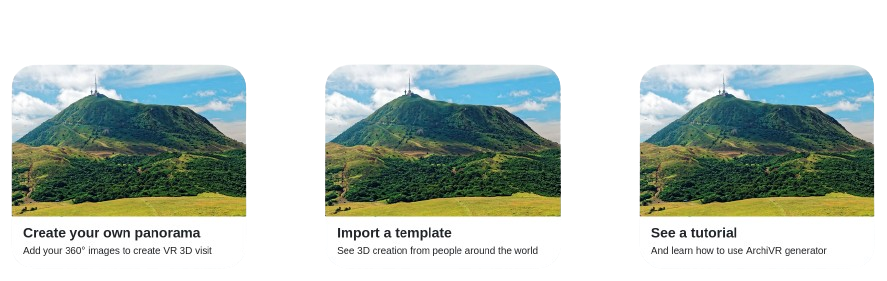

[](https://codefirst.iut.uca.fr/archivr/archivr) [](https://codefirst.iut.uca.fr/sonar/dashboard?id=archivr) [](https://codefirst.iut.uca.fr/sonar/dashboard?id=archivr)

[](https://codefirst.iut.uca.fr/sonar/dashboard?id=archivr) [](https://codefirst.iut.uca.fr/sonar/dashboard?id=archivr) [](https://codefirst.iut.uca.fr/sonar/dashboard?id=archivr)

### Built with

    


<div align="center">
    <h1>ArchiVR</h1
    <span>Create your own virtual 3D visit</span>
    
</div>

# About the project

Welcome to **ArchiVR**, a cutting-edge web application that allows you to craft immersive experiences from 360-degree images. Effortlessly transform your panoramic photos into interactive tours tailored to your specific needs.

### Key Features

- **360 Image Integration:** Upload your panoramic images to create a 360-degree immersive experience.
- **Custom Maps:** Add an interactive map to guide visitors through the virtual tour.
- **Environment Customization:** Incorporate 3D elements to personalize the environment and make the experience truly unique.
- **Multi-Platform Compatibility:** Generated virtual tours are compatible with Oculus, PC, and mobile devices, offering maximum flexibility for your users.

### How It Works

1. **Import Your Images:** Upload your panoramic images directly into the application.
2. **Customize Your Environment:** Add 3D elements, a map, and adjust settings to create the desired atmosphere.
3. **Generate Your Virtual Tour:** With a single click, obtain an HTML file ready to be deployed on Oculus, PC, or mobile.

# Getting started

Clone the repository :

```
git clone https://codefirst.iut.uca.fr/git/archivr/archivr
```

Start app using php :

```
php -S 127.0.0.1:8000 -t ./archivr/src/
```

#### Optional

If you want to upload personal 3D models _(.gltf)_, in your panorama, you have to update your `php.ini` (3D model files are too large for basic php config)

A script is available to update settings (currently bug with macOS) :

```
sudo ./3d-models-support.sh
```

If the script does not work, modify the following lines in your `php.ini` :

```
upload_max_filesize=20M
post_max_size=21M
```

To find your `php.ini` you can use :

```
php --ini
```

# Authors

This project was developed by students from the IUT of Aubière (UCA), as part of a university project. The team members are:

- [Aurian JAULT](https://codefirst.iut.uca.fr/git/aurian.jault)
- [Vincent ASTOLFI](https://codefirst.iut.uca.fr/git/vincent.astolfi)
- [Axel DE LA FUENTE](https://codefirst.iut.uca.fr/git/axel.de_la_fuente)

# Acknowledgements

Thanks to ours professors for their guidance and feedback throughout the development of this project.

- Sebastien SALVA (project tutor)

- Audrey POUCLET (project management tutor)
